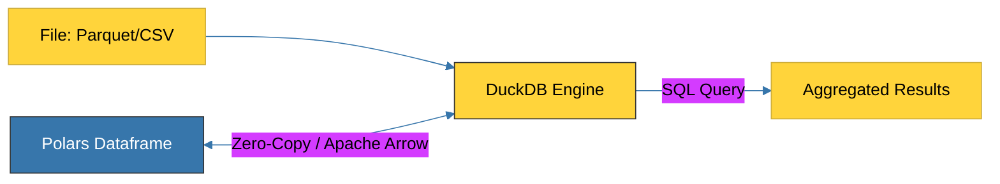

# BK-02: DuckDB OLAP (The In-Process Database) [x] Complete

> **"If Polars is the high-performance car, DuckDB is the efficient highway that lets you drive SQL directly through your data."**

Buku ini membedah **DuckDB**, database analitik (OLAP) tercepat yang dapat berjalan langsung di dalam proses Python Anda. Kita akan mempelajari bagaimana DuckDB memungkinkan kueri SQL super cepat pada file Parquet, CSV, dan Dataframe tanpa perlu menginstal server database terpisah.

---

## 🌐 Source Hub (Authority)
- **Primary Source**: [DuckDB Official Documentation](https://duckdb.org/)
- **Integration Guide**: [DuckDB & Polars Integration](https://duckdb.org/docs/guides/python/polars)

---

## 🧠 The Essence (Narrative)
Secara tradisional, "database" berarti server raksasa (seperti MySQL atau PostgreSQL). Untuk analitik data lokal, ini terlalu berat. **DuckDB** mendobrak batasan ini dengan menjadi **In-Process Database** (seperti SQLite) namun dengan desain **Columnar** (seperti Snowflake). Intisari dari bab ini adalah **Zero-Copy Architecture**: kemampuan DuckDB untuk mengambil data dari Polars atau Pandas tanpa menyalin datanya ke memori baru, menghemat RAM hingga 50%.

---

## 🎨 Visual Logic (DuckDB Data Exchange)



---

## 🛠️ Implementation: The SQL Hybrid
```python
import duckdb
import polars as pl

# 1. Load Data with Polars
df = pl.read_parquet("sales_data.parquet")

# 2. Query Dataframe with DuckDB SQL
# DuckDB secara otomatis mendeteksi variabel 'df' di scope Python!
result = duckdb.query("""
    SELECT 
        region, 
        SUM(sales) as total_sales 
    FROM df 
    GROUP BY region 
    ORDER BY total_sales DESC
""").pl() # Kembalikan sebagai Polars Dataframe

print(result)
```

---

## ⚠️ Pitfalls
- **Not for OLTP (Writes)**: Jangan gunakan DuckDB sebagai database untuk backend web Anda yang butuh ribuan penulisan per detik. Gunakan DuckDB khusus untuk **Analitik** dan **Reporting**.
- **Locking Mechanism**: Karena ia in-process, satu file database DuckDB hanya bisa dibuka oleh satu koneksi tulis dalam satu waktu.
- **MotherDuck Complexity**: Jika Anda mulai menggunakan ekstensi Cloud (MotherDuck), pastikan Anda memahami batasan latensi jaringan yang mungkin muncul saat menggabungkan data lokal dan data cloud.

---
*Back to [SR-01 Modern Data Stack](../README.md)*
