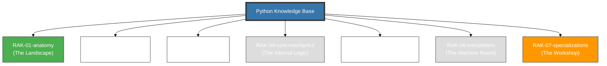

# Python Knowledge Base

> **"From Simple Scripts to AI Data Science."**

## 🏛️ Arsitektur 7-Rak (Universal Standard + Applied)

Repositori ini menggunakan **7-Rack Architecture** dengan prinsip **Digital Mirroring**. Enam Rak pertama membedah bahasa Python itu sendiri (dari jiwa hingga mesin), satu Rak terakhir mengaplikasikannya ke industri nyata.

---

## 🗄️ Struktur Perpustakaan

### Core Language (RAK-01 — RAK-06)

| # | Rak | Fokus | Status |
|---|---|---|---|
| 1 | [RAK-01-anatomy](./RAK-01-anatomy/) | Jiwa, Sejarah & Trade-offs | ✅ 100% |
| 2 | [RAK-02-foundation](./RAK-02-foundation/) | Sintaksis & Dasar Bahasa | ⚪ Planned |
| 3 | [RAK-03-evolution](./RAK-03-evolution/) | PEPs & Evolusi Versi | ⚪ Planned |
| 4 | [RAK-04-core-mechanics](./RAK-04-core-mechanics/) | Data Model & Internals | ⚪ Planned |
| 5 | [RAK-05-standard-library](./RAK-05-standard-library/) | Built-ins & Ecosystem | ⚪ Planned |
| 6 | [RAK-06-interpreters](./RAK-06-interpreters/) | CPython, Bytecode, GIL | ⚪ Planned |

### Applied Python (RAK-07)

| # | Rak | Fokus | Status |
|---|---|---|---|
| 7 | [RAK-07-specializations](./RAK-07-specializations/) | AI, ML, Web, Automation | ⚪ Planned |

---

## 📏 Standar Kualitas (Gold Standard)
Setiap materi mengikuti prinsip **Digital Mirroring** dan standar **PPM V4** yang mewajibkan:
1. **Source-Synced**: Akurasi 1:1 terhadap dokumentasi resmi/spesifikasi (docs.python.org / PEPs).
2. **Experimental Lab**: Kode pembuktian fungsional di folder `examples/` (.py).
3. **Mental Model Visual**: Diagram Mermaid inline.
4. **Narrative Excellence**: Penjelasan mendalam dengan analogi dunia nyata (The Serpent's Core).

*Dokumentasi Lengkap Standar: [docs/standards/architecture.md](./docs/standards/architecture.md)*

---
*Status Pengembangan: [status.md](./status.md)*
