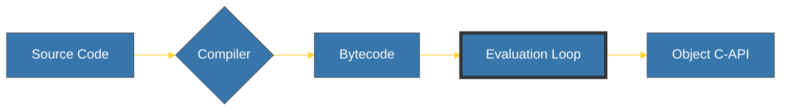
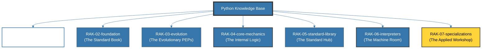

# Python Knowledge Base

> **"Mastering the Serpent's Core: From Simple Scripts to CPython Combustion."**

---

## 🌐 Strategic Parent
Repositori ini adalah pendalaman teknis (Workspace) yang terhubung ke peta induk:
**[Strategic Blueprint: Python](file:///i:/Workspace/Workspace-Syahputrawork/learning-matrix-blueprint/01-Language-Hubs/Python-Knowledge-Base.md)**

---

## 🔌 Hub Connections
Sebagai fondasi utama *automation & data orchestration*, Python di dalam Learning Matrix terhubung ke:
- **Execution Hubs**: `Server Runtime`, Automation runtimes.
- **Storage Hubs**: Data Engineering, Persistence scripting, ETL workflows.
- **Architecture Hubs**: `Repository Architecture`, `Application Architecture`.
- **Infrastructure Hubs**: `CI/CD Automation`, `Cloud Orchestration`, `CLI Tools`.
- **AI Orchestration**: The primary language for AI/ML engineering and LLM orchestration.

---

## 🏛️ The Architect's Mission

**Python** bukan sekadar bahasa pemrograman; ia adalah ekosistem pragmatis yang mengutamakan produktivitas manusia tanpa mengorbankan kedalaman teknis. Repositori ini didedikasikan untuk melakukan dekonstruksi mendalam terhadap Python melalui prinsip **Digital Mirroring** terhadap spesifikasi resmi **docs.python.org** dan **PEPs**.

Di sini, kita membedah alasan *mengapa* Python berperilaku tertentu di level internal (CPython), bagaimana memori dikelola melalui *Reference Counting*, dan bagaimana *Evaluation Loop* menggerakkan bytecode.

---

## 🧠 Core DNA: The Serpent's Core

Intuisi utama dari repositori ini adalah memodelkan Python sebagai sistem yang mengubah kejelasan sintaks menjadi instruksi bytecode yang efisien:

---

## 🗼 Arsitektur 7-Rak (Universal Standard + Applied)

Seluruh pengetahuan didekonstruksi ke dalam 7 lapisan logis untuk menjaga kejernihan mental model:

---

## 🗄️ Struktur Perpustakaan

### 1. [RAK-01: History & Landscape](./RAK-01-history-landscape/)
Filosofi desain (Zen of Python), sejarah CPython, dan posisi strategis di industri modern.

### 2. [RAK-02: Foundation](./RAK-02-foundation/)
Sintaks inti, primitive types, control flow, functions, dan basic OOP.

### 3. [RAK-03: Evolution](./RAK-03-evolution/)
Evolusi fitur melalui PEPs, "The Great Rift" (P2 vs P3), dan masa depan bahasa.

### 4. [RAK-04: Core Mechanics (Internal Logic)](./RAK-04-core-mechanics/)
Mekanisme tingkat lanjut: **Dunder Methods, Descriptors, Metaclasses, Async, dan Memory Management**.

### 5. [RAK-05: Standard Library](./RAK-05-standard-library/)
Bedah library bawaan kritis: `asyncio`, `dataclasses`, `itertools`, `pathlib`, `collections`.

### 6. [RAK-06: Interpreters (The Machine Room)](./RAK-06-interpreters/)
Dapur mesin: **CPython Source**, Parser, AST, Bytecode, GIL, dan JIT-options.

### 7. [RAK-07: Specializations (The Workshop)](./RAK-07-specializations/)
Penerapan nyata: **Data Science, AI Orchestration, Backend (FastAPI/Django), dan Automation**.

---

## 🧭 Gerbang Dokumentasi Pilar (SSOT)

Untuk menjaga kualitas **Gold Standard**, seluruh pengerjaan wajib mematuhi 4 pilar standar kami:

| Pilar | Deskripsi |
| :--- | :--- |
| 🏗️ **[Repository Standards](./docs/standards/repository-standards.md)** | Aturan Hierarki 6-Level & Konvensi Penamaan. |
| ✍️ **[Content Workflow](./docs/standards/content-workflow.md)** | Riset (Rule 0), PPM V4, & 8-Point README. |
| 🎨 **[Aesthetics & Tone](./docs/standards/aesthetics-and-tone.md)** | Visual Branding (Python Blue) & Precise Tone. |
| 🤝 **[Contribution Guide](./docs/standards/contribution-guide.md)** | Standar kualitas untuk kontribusi teknis. |

---

## 📊 Status Pengembangan
Pelacakan progress global dapat dilihat pada: **[status.md](./status.md)**

---
*Created with ❤️ by CPython Core Language Internalist.*
