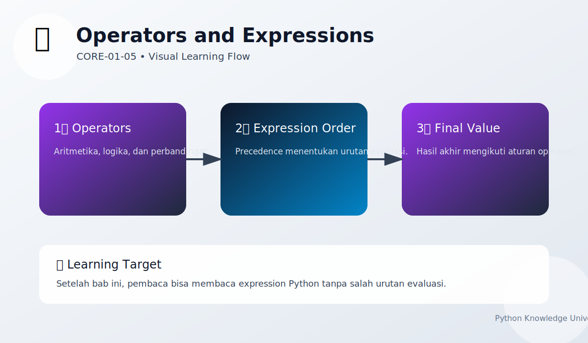

# Operators and Expressions

Chapter Code: CORE-01-05
Book Code: CORE-01
Version: v0.2.5
Last Updated: 2026-03-08
Status: In Progress
Difficulty: Basic
Estimated Time: 40 menit teori + 35 menit praktik

## Bab Ini Tentang Apa

Bab ini membahas operator dan expression sebagai inti pembentukan logika program Python. Pembaca akan memahami operator aritmatika, perbandingan, logika, assignment, serta prioritas evaluasi expression agar hasil perhitungan sesuai harapan.

## Prasyarat Spesifik Bab

- memahami `02_python_syntax.md`
- memahami `03_variables_and_names.md`
- memahami `04_basic_data_types.md`

## Istilah Kunci

| Istilah | Definisi Singkat | Contoh |
|---|---|---|
| operator | simbol untuk melakukan operasi | `+`, `==`, `and` |
| expression | kombinasi nilai/operator yang menghasilkan nilai | `a + b * 2` |
| precedence | urutan prioritas evaluasi operator | `*` dievaluasi sebelum `+` |
| short-circuit | evaluasi logika berhenti saat hasil sudah pasti | `False and ...` |
| augmented assignment | assignment singkat dengan operator | `x += 1` |

## Tujuan Besar

Membekali pembaca kemampuan membangun expression Python yang benar, terbaca, dan bebas bug logika dasar.

## Tujuan Kecil

- menggunakan operator dasar dengan tepat
- memahami hasil operator per tipe data
- membaca expression kompleks dengan prioritas evaluasi
- menghindari bug umum pada operator logika

## Hasil Belajar

Setelah menyelesaikan bab ini, pembaca diharapkan mampu:

- menjelaskan konsep inti bab dengan kata-kata sendiri
- menjalankan contoh utama tanpa error
- menerapkan konsep bab pada latihan dasar

## Peruntukan
Bab ini digunakan saat:

- menulis perhitungan dalam program
- membuat kondisi `if` yang melibatkan beberapa syarat
- memperbarui nilai variabel secara ringkas

## Bukan Peruntukan

Bab ini bukan untuk:

- optimasi expression tingkat lanjut
- pembahasan symbolic computation atau numeric library lanjutan

## Analogi

Operator seperti aturan matematika di kalkulator: jika salah urutan atau salah simbol, hasil akhirnya berbeda walau angkanya sama.

## Miskonsepsi Umum

- Miskonsepsi: expression dievaluasi dari kiri ke kanan tanpa aturan lain.
  Klarifikasi: Python punya precedence; beberapa operator dievaluasi lebih dulu.

- Miskonsepsi: `and` dan `or` selalu mengembalikan `True` atau `False`.
  Klarifikasi: di Python, `and`/`or` mengembalikan operand terakhir yang dievaluasi.

## Konsep Inti

### 1. Operator Aritmatika dan Assignment

```python
a = 10
b = 3

print(a + b)   # 13
print(a - b)   # 7
print(a * b)   # 30
print(a / b)   # 3.333...
print(a // b)  # 3
print(a % b)   # 1
print(a ** b)  # 1000
```

Augmented assignment:

```python
score = 10
score += 5
score *= 2
print(score)  # 30
```

### 2. Operator Perbandingan dan Logika

```python
age = 20
has_id = True

print(age >= 17)           # True
print(age < 17)            # False
print(age >= 17 and has_id)  # True
print(age < 17 or has_id)    # True
print(not has_id)            # False
```

### 3. Prioritas Evaluasi (Precedence)

```python
result1 = 2 + 3 * 4        # 14
result2 = (2 + 3) * 4      # 20
print(result1, result2)
```

Gunakan tanda kurung untuk membuat maksud expression lebih jelas.

## Diagram



Caption: Diagram memperlihatkan jenis operator, urutan evaluasi expression, dan dampaknya ke hasil akhir.

### Legenda Diagram

- kotak biru: operator
- kotak tengah: evaluasi expression
- kotak hijau: nilai hasil

## Contoh Kode (Benar)

```python
price = 100_000
discount = 0.2
final_price = price * (1 - discount)

print(final_price)
print(final_price > 70_000 and final_price < 90_000)
```

Expected output:

```text
80000.0
True
```

## Pitfall Umum

Menyamakan `=` dan `==`:

```python
x = 10
if x = 10:
    print("x is ten")
```

Perbaikan:

```python
x = 10
if x == 10:
    print("x is ten")
```

Pitfall precedence:

```python
result = 2 + 3 * 4  # sering disangka 20
print(result)
```

Perbaikan (eksplisit):

```python
result = (2 + 3) * 4
print(result)
```

## Catatan Praktis

- gunakan kurung jika expression mulai panjang
- pisahkan logika kompleks ke variabel boolean bernama jelas
- prioritaskan keterbacaan daripada menulis expression terlalu padat

## Latihan

### Dasar

Hitung luas persegi panjang dari `panjang` dan `lebar` menggunakan operator aritmatika.

### Menengah

Buat kondisi yang mengecek apakah nilai ujian lulus (`nilai >= 75`) dan kehadiran minimal 80%.

### Mini Challenge

Buat kalkulator diskon sederhana: input harga dan persen diskon, lalu tampilkan harga akhir dan status apakah diskon valid (`0 <= diskon <= 100`).

## Checklist Lulus Bab

- [ ] memahami operator aritmatika/perbandingan/logika
- [ ] menggunakan `==` dengan benar untuk perbandingan
- [ ] memahami precedence dasar dan penggunaan kurung
- [ ] menyelesaikan mini challenge

## Peta Keterkaitan

- Bab sebelumnya: `04_basic_data_types.md`
- Bab berikutnya: `06_control_flow.md`
- Keterkaitan lintas buku Core: `CORE-03` (Execution Model)

## Ringkasan

- Operator adalah alat utama membentuk expression di Python.
- Perbedaan assignment (`=`) dan comparison (`==`) wajib dikuasai.
- Gunakan precedence dengan sadar dan manfaatkan kurung untuk kejelasan.

## FAQ Singkat

1. Kapan pakai `//` dan kapan pakai `/`?
   Jawaban singkat: `/` untuk pembagian float, `//` untuk pembagian bulat (floor division).
2. Kenapa `and`/`or` kadang tidak mengembalikan bool?
   Jawaban singkat: karena Python mengembalikan operand terakhir yang dievaluasi.
3. Perlu selalu pakai kurung di expression?
   Jawaban singkat: tidak wajib, tapi sangat disarankan saat expression mulai kompleks.

## Referensi

- Python Expressions: https://docs.python.org/3/reference/expressions.html
- Python Operators (Built-in Types): https://docs.python.org/3/library/stdtypes.html
- Python Tutorial (More Control Flow Tools): https://docs.python.org/3/tutorial/controlflow.html

