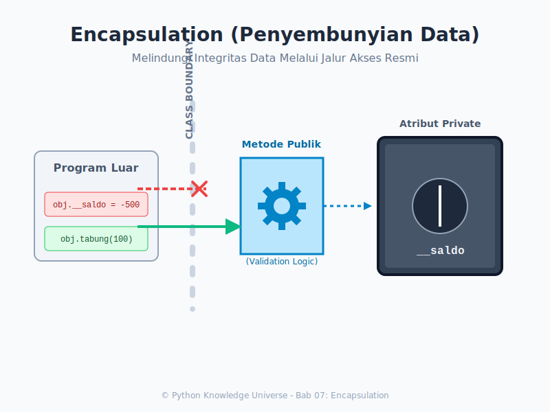

# Bab 07: Encapsulation

Chapter Code: CORE-03-07
Version: Core.Fundamentals.03.00
Last Updated: 2026-03-15
Status: Draft

> **Deskripsi Singkat**: Pembahasan mengenai Enkapsulasi, yaitu menyembunyikan detail internal objek dari dunia luar dan memaksakan interaksi melalui jalur resmi (Getter/Setter) untuk mencegah kerusakan data.

## 1. Analogi (Pendekatan Konsep)

### Analogi Singkat
> "Enkapsulasi itu seperti **Mesin ATM**. Anda (Program Luar) tidak bisa memutar tuas mesin di dalam ATM untuk mengambil uang secara paksa. Anda **wajib** menggunakan jalur resmi (Tombol Tarik Tunai dan PIN) yang sudah disediakan oleh Bank (Class)."

### Analogi Panjang / Cerita (Brankas Bank)
Bayangkan Anda membuat program untuk Rekening Bank. Saldo pengguna adalah nyawa dari program ini.

Jika Anda membiarkan saldo terbuka secara "Publik":
```python
rekening_budi.saldo = 5000000
# Seseorang yang iseng bisa saja menulis:
rekening_budi.saldo = "Banyak Uang" # Error tipe data
rekening_budi.saldo = -500        # Saldo minus tidak masuk akal
```

Oleh karena itu, sang Programmer (Arsitek Bank) memutuskan untuk menaruh Saldo di dalam **Brankas (Private Attribute)**. Tidak ada yang bisa menyentuh brankas itu secara langsung.

Jika `budi` ingin menabung atau menarik uang, ia harus berbicara kepada sang **Teller Bank (Method / Fungsi)**. Teller ini punya otak cerdas (Logika Validasi).
- Saat Budi mau menarik 1 juta, Teller mengecek dulu: "Apakah saldo cukup?". Jika cukup, Teller memotong saldo dari dalam brankas. Jika tidak, ia menolak. 
- Dengan begini, keamanan dan integritas isi brankas selalu terjaga. 

Inilah esensi Enkapsulasi: **Menyembunyikan Data, Menyediakan Pelayanan**.

## 2. Istilah Kunci (Key Terms)

| Istilah | Definisi Singkat | Contoh di Python |
|---|---|---|
| Encapsulation | Mengurung atribut/metode dalam kelas pelindung | - |
| Public | Data bebas diakses siapa saja (Default di Python) | `self.nama` |
| Protected | Data internal yang "sebaiknya" tidak disentuh dari luar | `self._nama` |
| Private | Data sangat rahasia, dilindungi ketat oleh *Name Mangling* | `self.__nama` |
| Name Mangling | Mekanisme Python mengubah nama atribut private | `_Akun__saldo` |
| Getter | Metode khusus untuk *Membaca* data rahasia | `get_saldo()` |
| Setter | Metode khusus untuk *Mengubah* data rahasia | `set_saldo(jumlah)` |

## 3. Konsep Utama

Di Python, aturan akses tidak kaku seperti Java (`public`, `private`). Python lebih mengandalkan budaya *"We are all consenting adults here"*. Artinya, jika ada tanda dilarang masuk, tolong jangan masuk—meskipun pintunya tidak benar-benar dikunci.

### A. Level Akses (Access Modifiers)

1. **Public (Normal)**
   Atribut biasa. Bisa dibaca dan ditulis dari mana saja.

2. **Protected (Awalan satu garis bawah `_`)**
   Contoh: `self._umur = 20`.
   Ini hanyalah **Peringatan Sopan**. Secara teknis, dari luar kelas masih bisa diubah (`obj._umur = 50`), namun programmer Python sepakat bahwa variabel dengan awalan `_` adalah urusan internal kelas tersebut dan dilarang dimanipulasi manual.

3. **Private (Awalan dua garis bawah `__`)**
   Contoh: `self.__saldo = 1000`.
   Python akan **mengubah nama variabel ini** secara diam-diam (Name Mangling) menjadi `_NamaKelas__saldo` agar tidak bisa tidak sengaja tertindih oleh *sub-class* dan menyulitkan akses dari luar.
   Meskipun begitu, jika Anda benar-benar mau, Anda *bisa* mengaksesnya dengan memanggil nama rahasianya.

### B. Getter dan Setter Klasik
Pendekatan lama (gaya C++/Java) untuk Enkapsulasi:

```python
class AkunBank:
    def __init__(self, nama, saldo_awal):
        self.nama = nama
        self.__saldo = saldo_awal  # Private
        
    # Getter: Hanya boleh melihat
    def dapatkan_saldo(self):
        return self.__saldo
        
    # Setter: Perantara pengubah dgn validasi
    def simpan_uang(self, nominal):
        if nominal > 0:
            self.__saldo += nominal
        else:
            print("Gagal: Nominal harus posifit!")
            
akun = AkunBank("Budi", 500)
akun.simpan_uang(100) # Memanggil metode pengubah
print(akun.dapatkan_saldo()) # 600
```
*(Catatan: Di Bab 11 nanti kita akan belajar cara yang jauh lebih elegan menggunakan `@property`)*

## 4. Visualisasi Analogi



## 5. Peringatan / Jebakan Umum (Gotchas)

- **Python Tidak Punya "Real Private"**: Jangan simpan *password database* ke variabel `__password` lalu merasa aman dari *hacker* lain yang memegang kode sumber; fungsi itu hanya mencegah modifikasi "tak sengaja" antar *programmer*, bukan fitur keamanan *cybersecurity*.
- **Over-Encapsulation**: Jangan membuat *getter* dan *setter* jika atribut tersebut memang boleh dan aman diubah bebas (seperti `self.nama_depan`). Cukup gunakan variabel *public* biasa untuk menghemat baris kode.

## 6. Referensi Kode Praktik

Buka folder `examples/` untuk melihat penerapan langsung:
- `01_simulasi_atm.py`: Demonstrasi brankas bank dan validasi *teller*.

## 7. Latihan (Validasi)

- [ ] Ubahlah kelas `KarakterGame` dengan atribut `__darah`.
- [ ] Buat *setter* `terima_damage(jumlah)` yang mengurangi `__darah` tapi memastikan darah tidak pernah turun di bawah 0.
- [ ] Cobalah akses secara paksa `karakter.__darah` dari baris paling luar dan lihat pesan *error* yang muncul.
