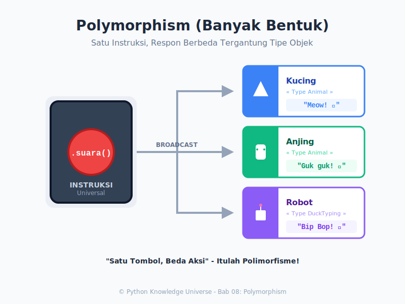

# Bab 08: Polymorphism

Chapter Code: CORE-03-08
Version: Core.Fundamentals.03.00
Last Updated: 2026-03-15
Status: Draft

> **Deskripsi Singkat**: Pemahaman tentang Polimorfisme (Sifat Banyak Bentuk), sebuah kemampuan objek untuk mengambil berbagai wujud, dan bagaimana sebuah instruksi yang sama bisa menghasilkan tindakan yang berbeda pada objek yang berbeda.

## 1. Analogi (Pendekatan Konsep)

### Analogi Singkat
> "Polimorfisme adalah instruksi **'Bicara!'** Jika Anda memberikan tombol 'Bicara' ke Bebek, ia berbunyi *Kwek*. Jika tombol yang sama ditekan pada Anjing, ia berbunyi *Guk*. Instruksinya sama, tapi eksekusinya menyesuaikan siapa yang menerimanya."

### Analogi Panjang / Cerita (Sutradara dan Aktor)
Bayangkan Anda adalah seorang Sutradara Teater (Fungsi/Program Utama), dan Anda memiliki 3 orang Aktor (Objek).

- Aktor A memerankan Singa.
- Aktor B memerankan Kucing.
- Aktor C memerankan Robot.

Sutradara tidak perlu memberikan skrip khusus untuk setiap orang:
*"Aktor A, tolong mengaum! Aktor B, tolong mengeong! Aktor C, tolong bunyi bip-bip!"*

Itu terlalu melelahkan (terlalu banyak `if-else`!).
Sutradara cukup memberikan satu instruksi universal:
**"SEMUANYA, BERSUARA!" ( `objek.bersuara()` )**

Setiap aktor sudah tahu (di dalam *Class* mereka masing-masing) bagaimana cara mereka harus bersuara. Singa akan mengaum, kucing akan mengeong. Inilah inti dari Polimorfisme: **Satu Antarmuka (Interface), Banyak Implementasi**.

## 2. Istilah Kunci (Key Terms)

| Istilah | Definisi Singkat | Contoh di Python |
|---|---|---|
| Polymorphism | Dari bahasa Yunani: Poly (Banyak) + Morph (Bentuk). | Fungsi `len()` bisa untuk String, List, Dict. |
| Method Overriding | Kelas anak menulis ulang (menimpa) metode kelas induknya dengan nama yang persis sama. | Induk punya `suara()`, Anak bikin `suara()` baru. |
| Duck Typing | Filosofi Python: "Jika ia berjalan seperti bebek dan bersuara seperti bebek, maka itu pastilah bebek." | Objek apapun yang punya `suara()`, dianggap valid. |
| Dynamic Typing | Tipe data dicek saat runtime (program berjalan), bukan saat kompilasi. | Python tidak mempedulikan keturunan pasti objeknya. |

## 3. Konsep Utama

### A. Polimorfisme Bawaan Python
Anda sudah menggunakan polimorfisme setiap hari tanpa sadar! Lihat operator `+`:
```python
# Polimorfisme pada angka (Penjumlahan Matematika)
print(1 + 2) # Hasil: 3

# Polimorfisme pada string (Penggabungan Teks)
print("Apel" + "Jeruk") # Hasil: ApelJeruk
```
Operator `+` memiliki "Banyak Bentuk" tergantung kepada siapa ia bekerja.

### B. Polimorfisme via Inheritance (Pewarisan)
Ini terjadi ketika banyak kelas (Anjing, Kucing) mewarisi dari satu kelas Induk (Hewan), lalu masing-masing anak **menimpa (override)** kemampuan induknya.

```python
class Hewan:
    def suara(self):
        pass # Belum jelas

class Kucing(Hewan):
    def suara(self):
        return "Meong"

class Anjing(Hewan):
    def suara(self):
        return "Guk"

# FUNGSI POLIMORFIK (1 Fungsi menangani banyak bentukan)
def tes_suara(hewan):
    print(hewan.suara())

tes_suara(Kucing()) # Output: Meong
tes_suara(Anjing()) # Output: Guk
```

### C. Polimorfisme via Duck Typing
Berbeda dengan Java/C++, Python adalah bahasa dinamis. Python tidak peduli apakah sebuah kelas memiliki hubungan *darah / keturunan* (Inheritance) atau tidak. Selama kedua objek punya metode dengan nama yang sama, Python akan mengizinkannya!

```python
class Alien:
    def suara(self): # Bukan turunan hewan, tapi punya metode "suara"
        return "Zzzzt bzzrp"

tes_suara(Alien()) # BISA! Output: Zzzzt bzzrp
```
Prinsip Python: *"Selama objek itu punya tombol suara(), tekan saja!"*

## 4. Visualisasi Analogi



## 5. Peringatan / Jebakan Umum (Gotchas)

- **AttributeError**: Hati-Hati saat *Duck Typing*. Jika Anda memasukkan objek yang ternyata tidak memiliki "tombol" `suara()` (misalnya kelas `Batu`), Python akan langsung mogok kerja dan protes keras dengan melempar *AttributeError*.
- **Overloading Tidak Ada**: Bahasa lain seperti Java mengenal *Method Overloading* (membuat dua fungsi dengan nama sama tapi jumlah parameter beda). Python **TIDAK MENDUKUNG** ini secara *native*. Fungsi terakhir yang Anda tulis akan menimpa fungsi sebelumnya.

## 6. Referensi Kode Praktik

Buka folder `examples/` untuk skrip simulasi teater:
- `01_suara_hewan.py`: Penerapan Overriding dan demonstrasi *Duck Typing* ekstrim.

## 7. Latihan (Validasi)

- [ ] Buat *parent class* bernama `Bentuk` dengan metode `hitung_luas()`.
- [ ] Buat 2 *child class* (`Persegi` dan `Lingkaran`) yang menimpa `hitung_luas()` dengan rumus matematika masing-masing.
- [ ] Buat sebuah *List* berisi 1 bentuk persegi dan 1 bentuk lingkaran.
- [ ] Lakukan pengulangan `for-loop` di list tersebut dan *print* luas masing-masing cetakan dalam SATU fungsi yang sama.
