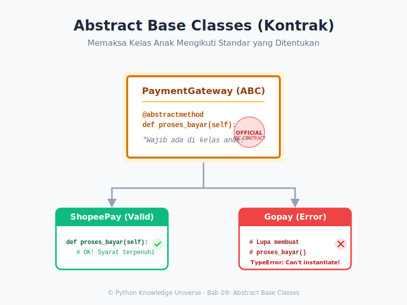

# Bab 09: Abstract Base Classes (ABC)

Chapter Code: CORE-03-09
Version: Core.Fundamentals.03.00
Last Updated: 2026-03-15
Status: Draft

> **Deskripsi Singkat**: Modul `abc` adalah cara elegan memaksa *Programmer Lain* untuk mematuhi kontrak. Di bab ini kita akan belajar peran dari Blueprint (Cetak Biru).

## 1. Analogi (Pendekatan Konsep)

### Analogi Singkat
> "ABC itu ibarat **ISO Standard**. Kelas anak yang mengaku-ngaku memproduksi 'Helm', tapi lupa memasang talinya *(Abstract Method belum ditulis)*, **dilarang keras dijual (di-*Instantiate*)**."

### Analogi Panjang / Cerita (Sistem Plugin Toko Online)
Bayangkan Anda membuat sebuah Perangkat Lunak Toko Online (*e-Commerce*).
Anda mempersilakan *programmer* dari bank-bank (BCA, Mandiri, PayPal) untuk membuat **Plugin Pembayaran** agar tersambung ke aplikasi Anda.

Bagaimana cara menjamin agar semua *programmer* eksternal itu ingat untuk membuat fungsi bernama "Bayar" di dalam program mereka? Jika mereka menamai fungsinya "PotongUang" (BCA) dan "AmbilSaldo" (PayPal), aplikasi utama Anda akan bingung saat harus memotong uang mereka di kasir karena nama fungsinya berbeda-beda! 

Solusinya:
Anda sebagai Pembuat Aplikasi Toko melempar selembar **Surat Kontrak Wajib (Abstract Base Class)** yang bertuliskan:
*"Setiap Plugin Pembayaran yang tersambung wajib menulis fungsi bernama TEPAT `.proses_bayar(jumlah)`."*

Jika Paypal ngeyel tidak membuat fungsi dengan nama tersebut, Python akan melempar peringatan keras yang mematikan *instantiation* kelas PayPal tersebut sejak pertama mesin dinyalakan.

## 2. Istilah Kunci (Key Terms)

| Istilah | Definisi Singkat | Contoh di Python |
|---|---|---|
| Kontrak / Interface | Rencana rancangan nama-nama metode yang disepakati untuk ada. | - |
| `abc` | Pustaka bawaan (Built-in Library) untuk _Abstract Base Classes_. | `from abc import ABC` |
| `@abstractmethod` | Topi (*Decorator*) yang dicap ke atas nama fungsi yang isinya wajib ada. | `@abstractmethod` |
| Instantiate | Membangkitkan atau "Melahirkan" *Object* (benda) dari *Class*. | `obj = Kelas()` |

## 3. Konsep Utama

Dunia C++ / Java / C# punya konsep bawaan untuk *Interface*. Python, dengan gaya dinamisnya, **sebenarnya tidak punya struktur asli *interface***. Oleh karena itu, kita dibantu oleh paket *Standard Library* mungil milik Python bernama `abc` (Abstract Base Classes) untuk meniru gaya bahasa statis.

### A. Apa itu Abstract Base Class?

Kelas abstrak adalah kelas yang **tidak bisa diubah menjadi Objek/Instance**. Itu karena fungsi yang dimilikinya masih berlubang (*Abstrak*). 

Lihatlah:
```python
from abc import ABC, abstractmethod

class Bentuk(ABC):
    @abstractmethod
    def hitung_luas(self):
        pass # Lubang
        
A = Bentuk() # TypeError seketika!! Objek A tidak memiliki kelengkapan nyawa.
```

### B. Membangun Keturunan dari ABC
Jika Anda mewarisi `Bentuk(ABC)`, Anda menyetujui kontrak ISO Standards tadi. Konsekuensinya adalah Anda harus menulis fungsi `hitung_luas()` dengan logika nyatanya.

```python
class Segitiga(Bentuk):
    def __init__(self, a, t):
        self.alas = a
        self.tinggi = t
        
    # Programmer memenuhi Kontrak (Method di-Override)!
    def hitung_luas(self):
        return 0.5 * self.alas * self.tinggi

# Python Mengecek: Apakah fungsi hitung_luas() ada isinya? -> ADA! 
# Sah meluncur!!
cetakan = Segitiga(10, 5)
```

## 4. Visualisasi Analogi



## 5. Peringatan / Jebakan Umum (Gotchas)

- **Lupa Import**: Pastikan Anda mengimpor HINGGA ke dekoratornya. (`from abc import ABC, abstractmethod`).
- **Penyakit Lupa Pass**: Pastikan semua `@abstractmethod` ditutup dengan instruksi `pass`. Jika Anda biarkan kosong, Python akan protes `IndentationError`.
- **TypeError Kultural**: Bagi Programmer yang baru hijrah dari PHP atau Go, Python mungkin terasa aneh tidak mendukung *Keyword Interface* natif. Belajar beradaptasi dengan impor Modul ABC adalah kewajiban jika sedang bekerja di agensi perangkat lunak besar yang kaku Aturan Standarisasinya.

## 6. Referensi Kode Praktik

Buka folder `examples/` untuk skrip simulasi e-Commerce:
- `01_payment_gateway.py`: Penerapan modul pembayaran dengan `ABC`.

## 7. Latihan (Validasi)

- [ ] Cobalah hapus `@abstractmethod` dari `01_payment_gateway.py`. Jalankan program kartu kredit (bagian `bayar_cc = KartuKredit()`). Apakah masih terjadi *error* TypeError penolakan instansiasi? Mengapa ini fatal?
- [ ] Rancanglah sebuah arsitektur Abstrak `Karyawan(ABC)` dengan aturan wajib `hitung_gaji()`. Lalu kembangkan dua anak `KaryawanTetap` dan `KaryawanKontrak`.
