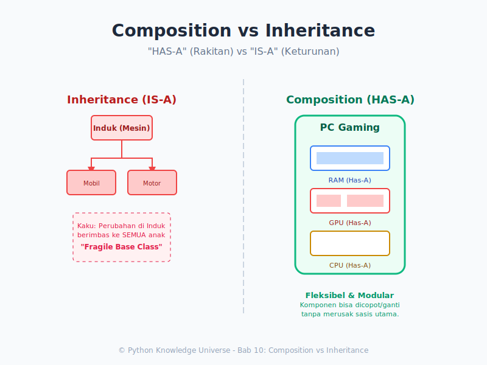

# Bab 10: Composition vs Inheritance

Chapter Code: CORE-03-10
Version: Core.Fundamentals.03.00
Last Updated: 2026-03-15
Status: Draft

> **Deskripsi Singkat**: Memahami perbedaan mendasar antara relasi "Is-A" (Pewarisan) dan "Has-A" (Komposisi), serta kapan saat yang tepat untuk menghindari jebakan keturunan yang terlalu dalam.

## 1. Analogi (Pendekatan Konsep)

### Analogi Singkat
> "Inheritance adalah hubungan **Keturunan Ayah-Anak** (Burung Hantu *adalah seekor* Burung). Composition adalah hubungan **Perakitan PC** (Komputer *memiliki sebuah* Prosesor)."

### Analogi Panjang / Cerita (Membangun Robot Kesatria)
Bayangkan Anda adalah insinyur pembuat robot. Anda ingin membuat Robot Kesatria (`RobotKesatria`) yang bisa menebas pedang.

**Jika menggunakan Inheritance (Pewarisan/IS-A):**
Anda membuat cetakan induk `RobotDasar`. Lalu Anda membuat `RobotKesatria` yang merupakan "Anak" (Keturunan) dari `RobotDasar`.
*Syarat Logis:* Robot Kesatria ADALAH sebuah Robot Dasar.
Semua kemampuan Robot Dasar akan otomatis turun temurun. Ini bagus. TAPI, bagaimana jika nanti Boss minta tambahan: "Tolong buat robot ini bisa terbang!"?
Jika Anda memaksakan `RobotTerbang` untuk kawin campur atau menurun jadi Induk si Kesatria, diagram silsilah keluarga robot Anda akan sangat berantakan dan membingungkan (*Diamond Problem* / *Deep Inheritance Tree*).

**Jika menggunakan Komposisi (HAS-A):**
Anda berpikir lebih cerdas. "Sebuah RobotKesatria BUKANLAH sebuah Pedang, BUKANLAH sebuah Mesin Terbang".
Tapi, RobotKesatria **MEMILIKI (HAS-A)** Pedang, dan **MEMILIKI** Mesin Sayap.

Anda membuat kelas `Pedang` secara terpisah.
Anda membuat kelas `SayapJet` secara terpisah.
Lalu, saat menciptakan kelas `RobotKesatria`, Anda merakit mereka di dalam "perut" (Metode `__init__`) milik Robot:
*"Robot, ini aku beri sebuah Pedang dan sebuah SayapJet. Simpan di tasmu!"*

Kapanpun Robot butuh terbang, ia tinggal memanggil fungsi `nyalakan()` milik `SayapJet` yang ada di dalam perutnya. Ini lebih rapi, modular, dan bebas dilepas-pasang (`plug and play`).

## 2. Istilah Kunci (Key Terms)

| Istilah | Definisi Singkat | Contoh di Python |
|---|---|---|
| IS-A Relationship | Hubungan "Adalah Sebuah" (Keturunan Identitas Pokok) | `class Kucing(Hewan):` |
| HAS-A Relationship | Hubungan "Memiliki Sebuah" (Komponen Eksternal) | `self.mesin = Mesin()` |
| Composition | Merakit objek besar dari potongan-potongan objek kecil yang diinjeksi ke dalam kelasnya | `self.tas = TasRansel()` |
| Favor Composition Over Inheritance | Prinsip desain perangkat lunak yang paling sering didengungkan oleh para pakar OOP (Design Patterns). | (Budaya *Best Practice*) |

## 3. Konsep Utama

Dilema paling umum bagi pemula di dunia OOP adalah mereka menggunakan `Class(ParentClass)` secara berlebihan. Ketika melihat kesamaan metode, mereka langsung mengawinkan Kelas-Kelas menjadi keluarga sedarah (Pewarisan).

**Aturan Emas (Golden Rule):**
1. Gunakan **Inheritance** JIKA kelas Anak benar-benar **"Adalah sebuah Varian Spesifik"** dari kelas Induk. (Misal: `class Manajer(Karyawan)`. Manajer memang 100% adalah Karyawan).
2. Gunakan **Composition** JIKA kelas Benda Utamanya **"Memiliki Komponen Ekstra Alat"** tersebut. (Misal: Manajer tidak mewarisi dari "MesinKetikan". Manajer BUKANLAH alat ketik. Tapi, Benda Utama (Manajer) **MEMILIKI** objek `mesin_tik`).

### Penerapan Singkat Komposisi Python

```python
# 1. Objek Kecil
class MesinKetik:
    def cetak_dokumen(self, teks):
        return f"Tik... Tik... {teks}"

# 2. Objek Besar
class Karyawan:
    def __init__(self, nama):
        self.nama = nama
        # Karyawan MENGKANDUNG (Komposisi) Mesin Ketik di dalam dadanya
        self.alat_kerja = MesinKetik()
        
    def bekerja(self):
        print(f"{self.nama} sedang bekerja memakai alat...")
        # Karyawan Mendelegasikan pekerjaannya ke Alat Kerja
        hasil = self.alat_kerja.cetak_dokumen("Laporan Tahunan 2026")
        print(hasil)

budi = Karyawan("Budi")
budi.bekerja()
```

## 4. Visualisasi Analogi



## 5. Peringatan / Jebakan Umum (Gotchas)

- **God Object Inheritance (Pohon Frankenstein)**: Hal terburuk di pemrograman adalah file kode 5000 baris bernama `KelasKendaraan` yang menjadi Ayah Tua Rentah dari semua jenis Mobil, Truk, Sepeda, Roket dan Kapal Selam dengan 20 level anak. Jika ada *Bug* di roda Kakek paling atas, seluruh keluarga kendaraannya (bahkan Kapal Selam!) akan *Crash*! Sebaiknya rakit Kendaraan melalui *Part-part* Komposisi dibanding menjadi sedarah daging semua.
- **Kesalahpahaman Mendelegasikan Tugas**: Saat mengelola 3 objek terkomposisi di dalam kelas Anda, pastikan masing-masing Benda fokus ke Kerjanya. Objek A (Bos) jangan menghitung bensin, ia hanya menyuruh Ban(Berputar).

## 6. Referensi Kode Praktik

Buka folder `examples/` untuk skrip simulasi pembuat perakitan:
- `01_komposisi_mobil.py`: Demonstrasi Pembuatan dan merakit berbagai Bagian.

## 7. Latihan (Validasi)

- [ ] Bayangkan skenario Aplikasi Warnet.
- [ ] Rancang `Class KomputerWarnet` yang berisi (`self.cpu = CPU()`, `self.monitor = Monitor()`). 
- [ ] Cobalah ciptakan objek monitor itu secara terpisah dan inject-kan dia (Komposisi).
