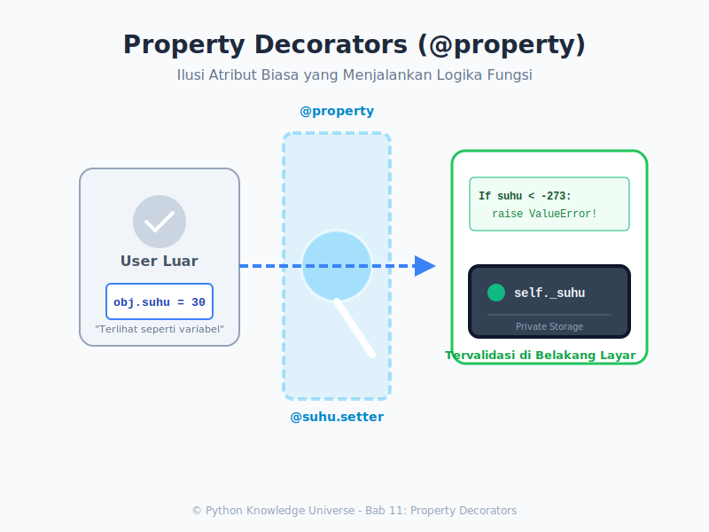

# Bab 11: Property Decorators

Chapter Code: CORE-03-11
Version: Core.Fundamentals.03.00
Last Updated: 2026-03-15
Status: Draft

> **Deskripsi Singkat**: Menggantikan *Getter* dan *Setter* klasik gaya Java yang merepotkan dengan keajaiban dekorator `@property` ala Python, untuk menjaga sintaks tetap elegan.

## 1. Analogi (Pendekatan Konsep)

### Analogi Singkat
> "@property adalah **Iklan Palsu yang Menguntungkan**. Dari luar, ia terlihat seperti Variabel biasa (Bisa ditunjuk dan diubah pakai tanda `=`). Namun di baliknya, ia menyembunyikan pasukan penjaga bersenjata (Fungsi Validasi) yang sangat ketat."

### Analogi Panjang / Cerita (Jendela Transparan ke Brankas)
Ingat analogi Enkapsulasi di Bab 07 tentang Brankas (`__saldo`)?
Di gaya lama, untuk menabung Anda harus berteriak: `akun.set_saldo(akun.get_saldo() + 100)`.
Sangat kaku dan melelahkan (dan tidak seperti kebiasaan *Pythonic* `a = a + 100`).

Dengan `@property`, Anda menaruh **Jendela Ajaib**.
- Pengguna melihat ke jendela itu dan melihat sebuah angka. Seolah-olah itu variabel biasa (`akun.saldo = 500`).
- Namun, saat pengguna mencoba menyelipkan uang ke dalam jendela itu ( `akun.saldo = 1000` ), Jendela tersebut **berubah menjadi Robot Teller (Setter)**.
- Robot ini menangkap uangnya, mengecek keasliannya (Validasi: apakah angkanya positif?), lalu membawanya masuk ke dalam Brankas rahasia (`_saldo`).

Ini memberi Anda dua keuntungan terbaik sekaligus:
1. Kode dari luar tetap mudah dibaca dan diketik (`obj.x = 10`).
2. Keamanan internal tetap terjaga ketat (jika `x = -5` dimasukkan, setter akan menembakkan Error).

## 2. Istilah Kunci (Key Terms)

| Istilah | Definisi Singkat | Contoh di Python |
|---|---|---|
| Property | Atribut kelas khusus yang perilakunya dikendalikan oleh fungsi | `obj.nama` |
| Decorator | Sintaks topi `@` yang merekatkan perilaku ekstra ke sebuah fungsi | `@property` |
| `@property` | Mengubah metode agar bertindak sebagai Getter (Read-only) | `@property def suhu()` |
| `@nama.setter` | Mengubah metode agar bertindak sebagai penangkap *Assignment* (`=`) | `@suhu.setter def suhu()` |
| `@nama.deleter` | Mengubah metode agar membersihkan sesuatu saat opsi `del` dipanggil | `@suhu.deleter def suhu()` |
| Pythonic | Gaya ngoding yang luwes dan "Sangat terasa Python-nya" | Menghindari `get_X()` |

## 3. Konsep Utama

### A. Anatomi Minimalist `@property`

Ini adalah **Getter**. Jika Anda hanya mendefinisikan ini, maka variabel ini **Read-Only** (hanya bisa dibaca, tidak bisa diubah). Coba mengubahnya (`pion.skor = 100`) akan melempar error keras (AttributeError).

```python
class Pemain:
    def __init__(self, s):
        self._score = s  # Simpanan riil
        
    @property
    def score(self):    # Wajah Publik (Getter)
        return self._score

pion = Pemain(50)
print(pion.score) # Memanggil tanpa tanda ()
```

### B. Anatomi Penuh `@setter`

Untuk membuat "Jendela" itu bisa menerima perubahan nilai lewat tanda sama dengan (`=`), kita bungkus dengan nama metodenya sendiri ditambah `.setter`.

```python
class KipasAngin:
    def __init__(self):
        self._speed = 1
        
    @property
    def speed(self):
        return self._speed
        
    @speed.setter            # Nama Setter WAJIB SAMA dengan nama Property Getter!
    def speed(self, new_val):
        """Teller Validasi Perubahan Level Kipas"""
        if 1 <= new_val <= 3:
            self._speed = new_val
        else:
            raise ValueError("Kecepatan HANYA boleh 1, 2, atau 3!")

kipas = KipasAngin()
kipas.speed = 2 # Setter menelannya, sukses!
kipas.speed = 5 # Teller Menolak: ValueError!
```

### C. Properti Komputasi (On-the-fly)

Kekuatan hebat lain dari properti adalah **Atribut Hantu**.
Anda punya Atribut A dan B. Lalu Anda membuat Property bernama C (Hasil pengolahan A dan B). Nilai C ini sebenarnya tidak pernah memakan memori/tersimpan di memori jangka panjang, dia dihitung saat itu juga (dinamis) setiap kali seseorang memanggil namanya! Cek file `examples` untuk skrip Termometer Celsius & Fahrenheit!

## 4. Visualisasi Analogi



## 5. Peringatan / Jebakan Umum (Gotchas)

- **Recursion Error Mengerikan (Rekursi Tiada Henti)**: Ini adalah KESALAHAN PALING UMUM SEDUNIA untuk Property Python!
Jika di dalam fungsi `@nama.setter def nama(self, val):` Anda menuliskan `self.nama = val`, saat dieksekusi, Setter itu memanggil SETTERNYA SENDIRI! Ini akan terus berputar memanggil diri sendiri sampai program meledak (`RecursionError`). Triknya: Di dalam blok setter/getter, Anda WAJIB menyentuh *Private-Variable* dengan Gores Bawah (`self._nama = val`). Jangan panggil namanya sendiri!
- **Nama Setter Beda**: Jangan membuat `@property def suhu()` lalu di bawahnya Anda menulis `@suhu.setter def temperatur()`. Metodenya harus memakai nama kembar (`suhu`).

## 6. Referensi Kode Praktik

Buka folder `examples/` untuk skrip simulasi setter getter cerdas:
- `01_konversi_suhu.py`: Contoh sinkronisasi Celsius & Fahrenheit secara otomatis lewat Properti komputasi.

## 7. Latihan (Validasi)

- [ ] Rancang kelas sederhana Pegawai dengan variabel privat `_gaji_bersih`.
- [ ] Rancang Property `gaji_pajak` yang mengembalikan (tanpa disimpan di RAM): `_gaji_bersih * 80%`.
- [ ] Buat Setter untuk `gaji_pajak` dengan logika balik: "Jika bos menuliskan budget Pegawai gaji pasca pajak 10.000, ubah variabel rahasia `_gaji_bersih` ke angka yang semestinya (sebelum dipotong pajak)."
