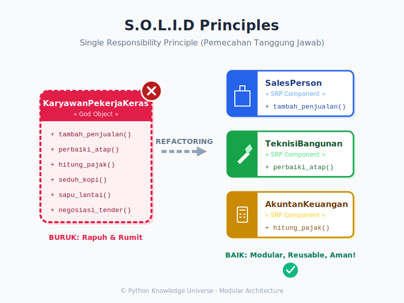

# Bab 12: OOP Best Practices (Praktik Terbaik)

Chapter Code: CORE-03-12
Version: Core.Fundamentals.03.00
Last Updated: 2026-03-15
Status: Draft

> **Deskripsi Singkat**: Menulis kode yang "Jalan" itu gampang. Mengubah tulisan yang gampang menjadi kode yang "Bisa dipertahankan sampai 5 tahun ke depan oleh tim yang berbeda" adalah Seni. Selamat datang di Bab Pamungkas dari seri Fundamentals OOP!

## 1. Analogi (Pendekatan Konsep)

### Analogi Singkat
> "Banyak orang bisa merakit **Meja Kayu** asal paku tertancap (Programming). Tapi hanya pengrajin handal yang memikirkan: Apakah serbuk kayunya sudah diamplas halus? Apakah paku ini bisa dicabut nanti jika meja mau diperpanjang? (Best Practices)."

### Analogi Panjang / Cerita (Bengkel Terburuk di Dunia)
Bayangkan Anda adalah bos dari **Bengkel Mobil (Class Besar)**.
Di dalam bengkel tersebut, Anda punya satu orang montir jenius bernama **SuperBudi**. Budi bisa menambal ban, mengecat mobil, mencatat kasir, hingga menyeduh kopi. Anda sangat senang karena cukup menggaji 1 orang. (Ini adalah **God Object**).

Tahun depan, bengkel Anda semakin laris. Pelanggan Kopi (Fitur B) marah karena SuperBudi sedang sibuk menambal ban (Fitur A). Saat SuperBudi sakit (Ada Error), SELURUH BENGKEL TUTUP!

Di dunia pemrograman profesional, kita menggunakan **S.O.L.I.D Principles**.
Hukum pertama yang paling dijunjung tinggi adalah **Single Responsibility Principle (SRP)**.

Anda *memecat* Budi. Anda menyewa:
1. Montir Ban (Fokus ban saja).
2. Kasir (Fokus uang saja).
3. Barista Kopi (Fokus minuman).

Sekarang, jika Kasir sakit (Error), Pelanggan masih bisa menambal ban dan minum kopi! Inilah kunci dari umur panjang kode aplikasi. Pisahkan tanggung jawab!

## 2. Istilah Kunci (Key Terms)

| Istilah | Definisi Singkat | Contoh / Penerapan |
|---|---|---|
| SOLID | Singkatan 5 hukum utama *Object-Oriented Design* | S = Single Responsibility |
| God Object / Fat Model | Satu Kelas raksasa ribuan baris yang mengurus segala fitur | Hindari ini! |
| Deep Inheritance | Pohon keluarga Pewarisan yang terlalu dalam (Kakek-Buyut) | A -> B -> C -> D -> E |
| Magic Methods | Metode ganda garis bawah bawaan Python (Dunder) | `__str__`, `__len__`, `__eq__` |
| MRO (Method Restn. Order)| Resolusi pencarian jalur keluarga jika ada kelas Ayah ganda | `__mro__` |
| DRY | *Don't Repeat Yourself*. Aturan jangan melakukan Copy-Paste! | Ekstrak *copy-paste* ke *Method* |

## 3. Konsep Utama & Praktik Terbaik

### A. Jauhi *Multiple Inheritance* Sebisa Mungkin
Secara teori, bahasa Python mengizinkan Anak lahir dari dua Ayah `class Anak(Ayah1, Ayah2)`. Tapi 95% arsitek senior melarang keras praktik ini untuk objek data. Mengapa? Karena rentan menimbulkan tabrakan nama dan memusingkan otak Anda sendiri saat mencari sumber dari sebuah bug (*Diamond Problem*). Gunakanlah **Komposisi** sebagai ganti dari *Multiple Inheritance*.

### B. Manfaatkan MRO Untuk Debugging
Jika Anda terpaksa berhadapan dengan kode *programmer* lama yang memakai pewarisan ganda, gunakan `NamaKelas.__mro__` untuk melihat dari keluarga mana sebetulnya sebuah *method* diciduk oleh si Python.

### C. Biasakan Menulis Dunder `__str__` atau `__repr__`
Saat objek robot Anda di-*print()*, apa yang tercetak di layar? `__main__.Robot object at 0x7b...` — Cukup buruk. 
Biasakan memformat wajah depan Class Anda agar mudah didokumentasikan.

```python
class Manusia:
    def __init__(self, nama): 
        self.nama = nama
        
    def __str__(self):
        # Dipakai saat print() manusia ini
        return f"<Objek Manusia: {self.nama}>"

budi = Manusia("Budi")
print(budi) # Keren! Objek langsung bisa dibaca!
```

### D. Lawan Asumsi dengan *Duck Typing*
Di Java, Anda mengecek: `"Apakah benda ini Hewan?"`.
Di Python terbaik, Anda cukup mencoba melakukan sesuatu dan langsung siap sedia menangkap *Error*\-nya jika gagal: **"Easier to Ask Forgiveness than Permission" (EAFP)**. 

Alih-alih: `if type(pesawat) == Burung: pesawat.terbang()`, gunakan Blok *Try Catch* (Bab 09 dari Buku 02 Data Logic)!:
`try: benda.terbang() except AttributeError: print("Benda ini tak bisa terbang!")`.

## 4. Visualisasi Analogi



## 5. Peringatan / Jebakan Umum (Gotchas)

- **Cacat Arsitektur Tidak Bisa Di-Hotfix**: Kesalahan ketik `1 + 2` bisa diperbaiki dalam 5 menit. Tapi jika Anda salah melandaskan pondasi (Misal salah membuat hubungan Inheritansi Manusia yang dianggap Turunan dari Meja karena sama-sama punya Kaki), proyek Anda harus dibongkar ulang dari minggu pertama! Pikirkan **Hubungan Abstrak** antar entitas Anda (Is-a vs Has-a) selama minimal sejam sebelum menulis baris pertama `class`.

## 6. Referensi Kode Praktik

Buka folder `examples/` untuk skrip simulasi refactoring:
- `01_solid_dan_mro.py`: Melihat kode jelek (Budi Montir) vs kode bagus (Pemecahan Tugas SRP) dan mengobservasi jalur silsilah lewat MRO.

## 7. Latihan Puncak (Ujian Akhir Buku)

Selamat! Anda telah menguasai cara Berpikir dengan Objek.
- [ ] Buatlah sebuah Sistem *Game RPG* Sederhana dengan menggabungkan Semua Bab.
- [ ] Buat *Abstract Base Class* `Karakter` dengan senjata `(Komposisi)`.
- [ ] Jadikan `Senjata` sebagai *Property Decorator*.
- [ ] Tulis *Override* untuk serangan yang berbeda (Penyihir vs Pendekar) - `Polimorfisme`.
- [ ] Beri apresiasi pada diri Anda sendiri. Anda telah resmi memahani fondasi Sistem Objek Python!
