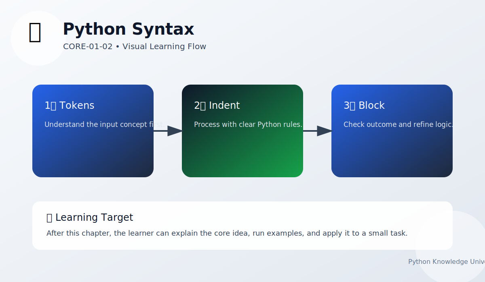

# Python Syntax

Chapter Code: CORE-01-02
Book Code: CORE-01
Version: v0.2.2
Last Updated: 2026-03-08
Status: In Progress
Difficulty: Basic
Estimated Time: 30 menit teori + 25 menit praktik

## Bab Ini Tentang Apa

Bab ini membahas aturan penulisan dasar Python agar kode bisa dibaca interpreter tanpa error syntax. Fokusnya ada pada indentation, blok kode, komentar, statement sederhana, dan gaya penulisan awal yang rapi. Ini adalah fondasi untuk semua bab setelahnya.

## Prasyarat Spesifik Bab

- sudah memahami workflow dasar dari bab `01_getting_started.md`
- dapat menjalankan file `.py` dari terminal
- memahami output sederhana `print()`

## Istilah Kunci

| Istilah | Definisi Singkat | Contoh |
|---|---|---|
| statement | satu instruksi Python | `x = 10` |
| block | kumpulan statement dengan indentation sama | isi `if`, `for`, `def` |
| indentation | spasi di awal baris untuk menandai blok | `if cond:\n    print(...)` |
| comment | catatan yang diabaikan interpreter | `# ini komentar` |

## Tujuan Besar

Membentuk cara menulis kode Python yang valid, konsisten, dan mudah dibaca sejak awal.

## Tujuan Kecil

- memahami kenapa indentation wajib di Python
- menulis statement dan blok dengan benar
- membedakan komentar dan kode eksekusi
- mengenali error syntax paling umum

## Peruntukan

Bab ini digunakan saat:

- baru mulai menulis kode Python sendiri
- sering menemui `SyntaxError` atau `IndentationError`
- ingin membentuk kebiasaan coding yang rapi

## Bukan Peruntukan

Bab ini bukan untuk:

- pembahasan fitur bahasa tingkat lanjut
- optimasi struktur program kompleks

## Analogi

Sintaks Python seperti tata bahasa dalam menulis kalimat: idenya bisa benar, tapi kalau struktur kalimat salah, pembaca tidak bisa memahami maksudnya.

## Miskonsepsi Umum

- Miskonsepsi: indentation hanya soal gaya.
  Klarifikasi: di Python, indentation menentukan struktur blok dan memengaruhi eksekusi.

- Miskonsepsi: komentar memperlambat program secara signifikan.
  Klarifikasi: komentar diabaikan interpreter saat runtime.

## Konsep Inti

### 1. Statement dan Blok Kode

Statement adalah instruksi tunggal. Blok adalah kumpulan instruksi dengan indentation sama.

```python
x = 10
if x > 5:
    print("x lebih besar dari 5")
```

Baris `print(...)` berada di dalam blok `if` karena indentation.

### 2. Indentation Konsisten

Gunakan 4 spasi per level blok. Hindari campuran tab dan spasi.

```python
for i in range(3):
    print(i)
```

### 3. Komentar dan Keterbacaan

Komentar membantu menjelaskan alasan kode, bukan mengulang isi kode.

```python
# Hitung total harga setelah diskon
final_price = price - discount
```

## Diagram



Caption: Diagram menunjukkan alur dari aturan sintaks ke proses interpretasi dan hasil eksekusi/error.

### Legenda Diagram

- kotak biru: aturan syntax input
- kotak tengah: parsing/interpreting
- kotak hijau: output valid atau error syntax

## Contoh Kode (Benar)

```python
name = "Syahputra"
if name:
    print(f"Halo, {name}")
```

Expected output:

```text
Halo, Syahputra
```

## Pitfall Umum

Contoh kesalahan yang sering terjadi:

```python
if True
    print("missing colon")
```

Perbaikan:

```python
if True:
    print("colon fixed")
```

Contoh lain (indentation tidak konsisten):

```python
if True:
print("bad indent")
```

Perbaikan:

```python
if True:
    print("good indent")
```

## Catatan Praktis

- gunakan editor yang menampilkan indentation dengan jelas
- aktifkan format otomatis jika tersedia
- jalankan kode kecil secara berkala untuk validasi syntax

## Latihan

### Dasar

Tulis 3 statement Python sederhana: assignment, print, dan if.

### Menengah

Buat blok `if-else` dengan indentation benar dan tambahkan komentar penjelas.

### Mini Challenge

Buat script yang mengecek umur pengguna, lalu menampilkan kategori: `anak`, `remaja`, atau `dewasa`.

## Checklist Lulus Bab

- [ ] menulis statement Python tanpa `SyntaxError`
- [ ] menggunakan indentation konsisten 4 spasi
- [ ] bisa menjelaskan fungsi komentar
- [ ] menyelesaikan mini challenge

## Peta Keterkaitan

- Bab sebelumnya: `01_getting_started.md`
- Bab berikutnya: `03_variables_and_names.md`
- Keterkaitan lintas buku Core: `CORE-03` (Execution Model)

## Ringkasan

- Sintaks adalah aturan dasar agar kode bisa dijalankan Python.
- Indentation di Python bersifat struktural, bukan sekadar estetika.
- Membaca dan memperbaiki error syntax adalah skill wajib sejak awal.

## FAQ Singkat

1. Kenapa Python sensitif terhadap indentation?
   Jawaban singkat: karena indentation dipakai untuk menentukan blok kode.
2. Lebih baik pakai tab atau spasi?
   Jawaban singkat: gunakan 4 spasi agar konsisten dengan standar Python.
3. Komentar idealnya ditulis kapan?
   Jawaban singkat: saat perlu menjelaskan alasan/niat kode yang tidak langsung terlihat.

## Referensi

- Python Tutorial (Informal Introduction): https://docs.python.org/3/tutorial/introduction.html
- Python Tutorial (Control Flow): https://docs.python.org/3/tutorial/controlflow.html
- Python Lexical Analysis: https://docs.python.org/3/reference/lexical_analysis.html
