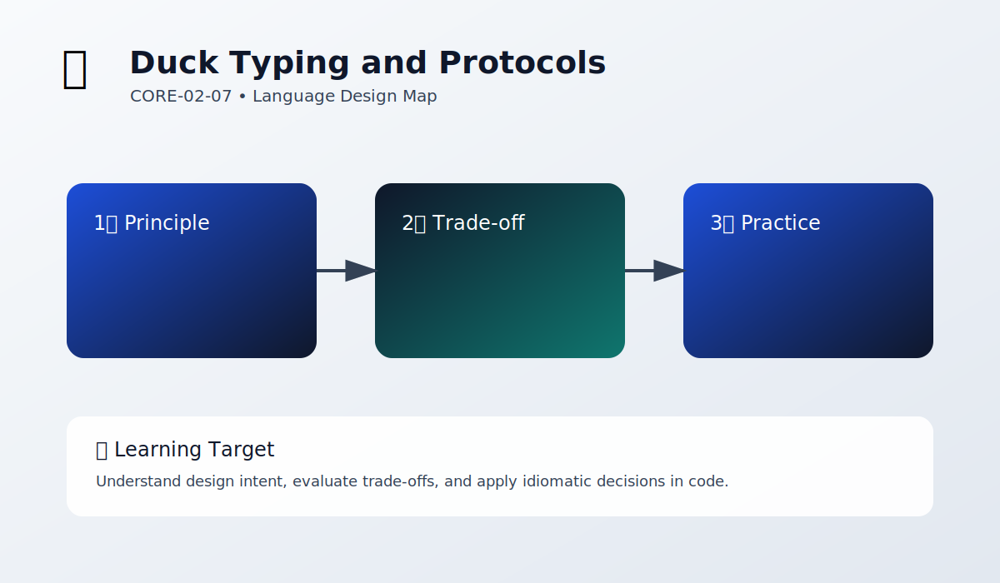

# Duck Typing and Protocols

Chapter Code: CORE-02-07
Book Code: CORE-02
Version: v0.2.0
Last Updated: 2026-03-08
Status: Planned
Difficulty: Intermediate
Estimated Time: 45 menit teori + 40 menit praktik

## Bab Ini Tentang Apa

Bab ini membahas konsep inti duck typing and protocols dalam konteks filosofi desain bahasa Python.

## Prasyarat Spesifik Bab

- memahami bab sebelumnya (jika ada)
- memahami dasar sintaks Python dari CORE-01

## Istilah Kunci

| Istilah | Definisi Singkat | Contoh |
|---|---|---|
| language design | prinsip perancangan bahasa | readability over cleverness |
| trade-off | kompromi antar tujuan desain | simplicity vs flexibility |

## Tujuan Besar

Membantu pembaca memahami alasan desain Python agar keputusan coding lebih sadar konteks.

## Tujuan Kecil

- mengenali prinsip inti topik bab
- menghubungkan prinsip dengan praktik coding
- mengidentifikasi trade-off dasar pada kasus sederhana

## Hasil Belajar

Setelah menyelesaikan bab ini, pembaca diharapkan mampu:

- menjelaskan prinsip utama bab ini
- menerapkan prinsip pada contoh kode sederhana
- mengevaluasi dampak desain pada keterbacaan kode

## Peruntukan

Bab ini digunakan saat:

- ingin memahami "mengapa" di balik gaya Python
- ingin menulis kode yang lebih idiomatik

## Bukan Peruntukan

Bab ini bukan untuk:

- pembahasan internal CPython detail rendah
- pembahasan implementasi compiler/interpreter mendalam

## Analogi

Anggap desain bahasa seperti arsitektur kota: keputusan tata letak memengaruhi semua aktivitas di dalamnya.

## Miskonsepsi Umum

- Miskonsepsi: desain bahasa hanya urusan pembuat bahasa.
  Klarifikasi: pemrogram tetap terdampak langsung oleh keputusan desain.

- Miskonsepsi: aturan gaya hanya preferensi pribadi.
  Klarifikasi: banyak aturan gaya berakar dari filosofi desain bahasa.

## Konsep Inti

### 1. Prinsip Dasar

Jelaskan prinsip utama yang dibahas di bab ini dan hubungannya dengan kode Python.

### 2. Dampak Praktis

Jelaskan bagaimana prinsip ini memengaruhi keputusan coding sehari-hari.

## Diagram



Caption: Diagram memetakan alur konsep utama bab dan dampaknya ke praktik coding.

### Legenda Diagram

- 1️⃣: konsep awal
- 2️⃣: proses analisis
- 3️⃣: keputusan praktis

## Contoh Kode (Benar)

```python
# contoh sederhana penerapan prinsip desain
message = "Readability matters"
print(message)
```

Expected output:

```text
Readability matters
```

## Pitfall Umum

Contoh kesalahan yang sering terjadi:

```python
# kode terlalu kompleks untuk masalah sederhana
result = [x for x in range(10) if (x % 2 == 0 and x > 3) or (x == 1)]
```

Perbaikan:

```python
# pecah logika agar intent lebih jelas
result = []
for x in range(10):
    if x % 2 == 0 and x > 3:
        result.append(x)
```

## Catatan Praktis

- prioritaskan kejelasan intent
- dokumentasikan keputusan desain yang tidak obvious
- hindari clever code jika mengorbankan readability

## Latihan

### Dasar

Identifikasi satu keputusan desain Python yang kamu lihat pada contoh bab ini.

### Menengah

Refactor contoh kode agar lebih jelas tanpa mengubah hasil.

### Mini Challenge

Buat script kecil lalu jelaskan trade-off desain yang kamu pilih (kejelasan vs keringkasan).

## Checklist Lulus Bab

- [ ] memahami prinsip inti bab
- [ ] mampu menjelaskan trade-off dasar
- [ ] menyelesaikan mini challenge
- [ ] bisa menjelaskan alasan refactor

## Peta Keterkaitan

- Bab sebelumnya: 06_mutability_and_object_thinking.md
- Bab berikutnya: 08_errors_as_part_of_design.md
- Keterkaitan lintas buku Core: CORE-06

## Ringkasan

- topik bab ini membentuk dasar language design Python
- keputusan desain memengaruhi kode harian
- pemahaman prinsip desain meningkatkan kualitas implementasi

## FAQ Singkat

1. Kenapa perlu belajar language design sebagai developer aplikasi?
   Jawaban singkat: supaya keputusan coding lebih terarah dan konsisten.
2. Apakah prinsip desain selalu absolut?
   Jawaban singkat: tidak, sering ada trade-off antar prinsip.
3. Bagaimana menerapkan bab ini ke proyek nyata?
   Jawaban singkat: evaluasi keputusan kode dengan kriteria readability, maintainability, dan consistency.

## Referensi

- Python Tutorial: https://docs.python.org/3/tutorial/
- Python Language Reference: https://docs.python.org/3/reference/
- PEP Index: https://peps.python.org/
