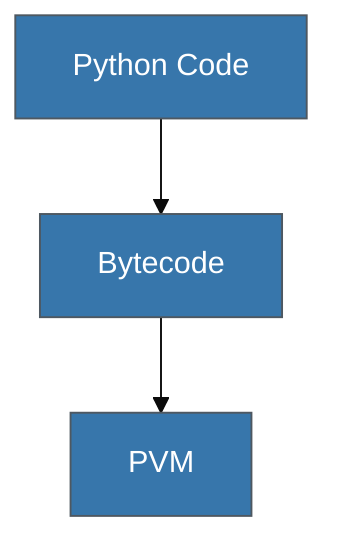

# Panduan Estetika Visual (Python Edition)

Produk akhir harus terasa bersih, ramah, dan akademis namun praktis.

## 1. Skema Warna (Branding)
- **Primary Color**: `#3776AB` (Python Blue).
- **Secondary Color**: `#FFD43B` (Python Yellow).
- **Background**: `#FFFFFF` (Clean White).

## 2. Standar Mermaid
Diagram harus terlihat rapi dan simetris:

## 3. Simbol Visual
- **Ular/S**: Gunakan sebagai ikon ornamen kecil untuk tips "Pythonic".
- **Garis Lembut**: Mewakili keanggunan alur kode Python.
- **Ikon Buku**: Mewakili setiap **Buku (BK)**.
