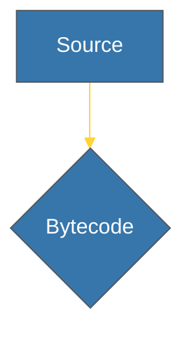

# Aesthetics & Tone: Visual & Verbal Identity

Dokumen ini mengatur identitas visual (Branding) dan gaya bahasa (Tone) untuk menjaga konsistensi repositori Python Knowledge Base.

---

## 🎨 1. Estetika Visual (Branding)

### Skema Warna Utama
- **Primary Color**: `#3776AB` (Python Blue) - Warna utama aksen.
- **Secondary Color**: `#FFD43B` (Python Yellow) - Eleman sekunder/spesifik.

### Standar Diagram Mermaid
Diagram harus menggunakan tema seragam untuk keterbacaan tinggi:

### Simbol Visual (Mental Models)
- **Serpent Loop**: Mewakili *Evaluation Loop* CPython.
- **Warna Biru**: Digunakan untuk elemen "Pure" atau "Idiomatic".
- **Warna Kuning**: Digunakan untuk elemen eksternal atau mutasi objek rendah.

---

## 🗣️ 2. Tone Suara & Terminologi (Verbal)

### Gaya Bahasa "Presisi & Elegan"
Gunakan kata kerja aktif yang mencerminkan kemudahan namun kekuatan Python:
- Gunakan: *"Instantiated"*, *"Intercepted"*, *"Transformed"*, *"Evaluated"*.

### Akurasi Spesifikasi (Senior Terms)
Gunakan terminologi teknis yang tepat:
- **Dunder Methods** (bukan sekadar simbol ganda).
- **Reference Counting** (bukan sekadar manajemen memori).
- **Evaluation Loop** (bukan sekadar penafsiran bytecode).
- **Duck Typing** (bukan sekadar antarmuka).

---

## 🧠 3. Core DNA Thinking (Mental Models)

Setiap materi yang ditulis wajib mencerminkan pilar DNA Python berikut:

### I. Memory Management (Reference Counting)
Gunakan perspektif internal untuk menjelaskan alokasi memori melalui `ob_refcnt` dan `gc`.

### II. Evaluation & Bytecode
Visualisasikan bagaimana kode ditransformasikan menjadi objek bytecode sebelum dieksekusi oleh mesin virtual CPython.

### III. Everything is an Object (Object Semantics)
Tekankan bahwa semua elemen di Python (termasuk fungsi dan kelas) adalah turunan dari `PyObject` di level C.

---
| Term | Analogi | Keterangan |
| :--- | :--- | :--- |
| **RAK (Rack)** | Domain | Area ilmu besar (Level 2). |
| **SR (Sub-Rack)** | Track | Jalur spesifik di dalam domain (Level 3). |
| **BK (Book)** | Koleksi | Modul utuh yang terdiri dari bab (Level 4). |
| **CH (Chapter)** | Materi | Unit pengerjaan teknis (Level 5). |
| **SEC (Section)** | Detil | Kedalaman spesifik (Level 6). |
